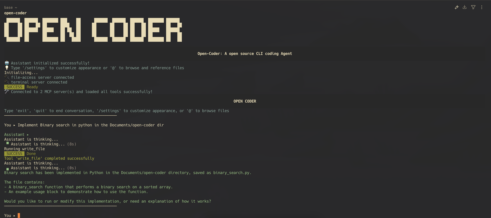

# Open Coder 🤖


A powerful AI coding agent that can interact with your codebase through natural language conversations while having full access to create, read, delete, and update files using the Model Context Protocol (MCP).

## 🌟 Features

- **Natural Language Interface**: Chat with the AI agent using plain English
- **File System Operations**: Complete CRUD (Create, Read, Update, Delete) operations on files
- **Model Context Protocol (MCP)**: Extensible tool system for adding new capabilities
- **Streaming Responses**: Real-time AI responses with tool execution feedback
- **Interactive Chat Loop**: REPL-style interface for continuous conversations
- **Multi-server Support**: Connect to multiple MCP servers simultaneously
- **Interactive Settings Menu**: Customize colors, display options, and chat behavior
- **File Browser Integration**: Use `@` command to interactively browse and reference files
- **Color Customization**: Personalize the appearance with different color schemes
- **Display Options**: Toggle compact mode, timestamps, and hidden file visibility
- **Auto-save Conversations**: Automatically save chat history to files

## 📁 Project Structure

```
open-coder/
├── main.go                 # Main AI agent implementation
├── go.mod                 # Go module dependencies
├── go.sum                 # Dependency checksums
├── README.md              # This file
├── install.sh             # One-script installer (builds and installs everything)
└── tools/                 # MCP server tools directory
    ├── file-access/       # File operations MCP server
    │   ├── main.go        # Server implementation
    │   └── README.md      # Documentation
    ├── terminal/          # Terminal operations MCP server
    │   ├── main.go        # Server implementation
    │   └── README.md      # Documentation
    └── your-tool/         # Add your own MCP servers here!
        └── main.go        # Your custom MCP server
```

**✨ Dynamic Tool System**: Add any MCP server to the `tools/` directory and it will be automatically:
- Built by `install.sh`
- Installed to `~/.open-coder/`
- Connected by `main.go`

## 🔧 Tools & Capabilities

Open-Coder automatically discovers and connects to all MCP servers in the `tools/` directory.

### Built-in Tools

#### File Operations MCP Server (`tools/file-access/`)
Provides 8 comprehensive file and directory operations:
1. **`read_file`** - Read file contents with optional line ranges
2. **`read_line_range`** - Read specific lines or a range from a file
3. **`write_file`** - Create or overwrite files with content
4. **`edit_line_range`** - Edit specific lines or a range in a file
5. **`list_directory`** - List directory contents (with recursive option)
6. **`search_files`** - Find files by name patterns using glob syntax
7. **`search_content`** - Search text within files with context
8. **`delete_file`** - Delete files/directories (with recursive option)

#### Terminal Operations MCP Server (`tools/terminal/`)
Provides system command execution capabilities:
1. **`run_terminal_cmd`** - Execute system commands with arguments
2. **`run_terminal_cmd_with_input`** - Execute commands with stdin input

### Adding Custom Tools

**✨ Zero Configuration**: Simply add your MCP server to the `tools/` directory:

```
tools/
└── my-custom-tool/
    └── main.go  # Your MCP server implementation
```

**Example Tool Structure:**
```go
// tools/my-custom-tool/main.go
package main

import (
    "context"
    "fmt"
    "github.com/modelcontextprotocol/go-sdk/mcp"
)

type CustomServer struct{}

func (c *CustomServer) MyCustomFunction(ctx context.Context, params map[string]interface{}) (interface{}, error) {
    return "Hello from my custom tool!", nil
}

func main() {
    server := &CustomServer{}

    mcpServer := mcp.NewServer(&mcp.Implementation{
        Name: "my-custom-tool",
        Version: "1.0.0",
    }, nil)

    // Add your tools here
    tool := &mcp.Tool{
        Name:        "my_custom_function",
        Description: "My custom functionality",
        InputSchema: map[string]interface{}{
            "type": "object",
            "properties": map[string]interface{}{},
        },
    }

    mcpServer.AddTool(tool, server.MyCustomFunction)

    // Server will listen for MCP protocol messages
    mcpServer.Listen(os.Stdin, os.Stdout)
}
```

**Automatic Discovery**: The install script and main application will automatically:
- Build your tool as `my-custom-tool-cli`
- Install it to `~/.open-coder/`
- Connect it as an MCP server named `my-custom-tool`
- Load all its available tools

**Result**: Your custom tool is now available in Open-Coder without any code changes!

## 🚀 Quick Start

### Prerequisites

- **For building**: Go 1.25.1 or later
- **For running**: OpenAI API key and terminal access
- **Standalone executable**: Once built and installed, no Go installation required

### 1. Clone and Setup

```bash
cd /Users/shivanshi/Documents/open-coder
```

### 2. Install Dependencies

```bash
go mod tidy
```

### 3. Install Open-Coder (One Command!)

```bash
# This builds AND installs everything automatically
./install.sh
```

The install script will:
- ✅ Check for Go installation
- ✅ **Auto-discover and build ALL tools** in the tools/ directory
- ✅ Install main application and all MCP servers to ~/.open-coder/
- ✅ Add to your PATH
- ✅ Configure environment variables

**✨ Dynamic Tool Discovery**: Any tool added to `tools/tool-name/main.go` will be automatically built and connected!

### 4. Run the Agent

```bash
open-coder
```

On first run, you'll be prompted to enter your OpenAI configuration:
- API Key
- Base URL
- Model

This configuration is automatically saved to `~/.open-coder/config` and won't need to be entered again.

You can also set environment variables to override the saved configuration:
```bash
export OPENAI_API_KEY="your-openai-api-key-here"
export OPENAI_BASE_URL="https://api.openai.com/v1"  # or your custom endpoint
export OPENAI_MODEL="gpt-4o-mini"  # or your preferred model
```

## 💬 Usage

Once running, the agent provides an interactive chat interface:

```
==================================================
                     OPEN CODER
Open-Coder: A open source CLI coding Agent
--------------------------------------------------
🤖 Assistant initialized successfully!
💡 Type '/settings' to customize appearance or '@' to browse and reference files
🛠️  All tools loaded successfully!
==================================================

You ▸

Assistant ▸
--------------------------------------------------
```

### Interactive Commands

- **`/settings`** - Open the interactive settings menu to customize:
  - 🎨 **Appearance**: Customize colors for assistant, user, system, tools, and error messages
  - 🖥️  **Display Options**: Toggle compact mode, timestamps, and hidden file visibility
  - 💾 **Chat Behavior**: Enable/disable auto-save conversations
  - 🔌 **MCP Server Settings**: Manage connected servers and refresh tools
  - ⚙️  **Configuration**: Update API key, base URL, and model settings

- **`@`** - Open the interactive file browser to select and reference files in your messages

### Basic File Operations

```
You > Create a new Python file with a hello world function

Assistant:
🔧 Executing tools...
⚙️  Calling: write_file
✅ Tool completed: write_file

You > Read the file I just created

Assistant:
🔧 Executing tools...
⚙️  Calling: read_file
✅ Tool completed: read_file

You > List all Python files in the current directory

Assistant:
🔧 Executing tools...
⚙️  Calling: search_files
✅ Tool completed: search_files
```

### Advanced Usage with File Browser

```
You > @ Create a function in the file I want to select

Assistant:
🔍 File Browser - Select a file to reference:
📁 Current directory: /Users/shivanshi/Documents/open-coder
📂 Directories:
  1. 📁 tools
📄 Files:
  2. 📄 main.go
  3. 📄 README.md

Enter choice: 2
✅ Selected file: /Users/shivanshi/Documents/open-coder/main.go
📎 File path inserted: /Users/shivanshi/Documents/open-coder/main.go

Assistant:
🔧 Executing tools...
⚙️  Calling: read_file
✅ Tool completed: read_file
```

## 🔌 Available Commands

- **`read_file`** - Read file contents
  ```json
  {
    "path": "example.py",
    "offset": 1,
    "limit": 10
  }
  ```

- **`read_line_range`** - Read specific lines or a range from a file
  ```json
  {
    "path": "example.py",
    "start_line": 5,
    "end_line": 15,
    "show_line_numbers": true
  }
  ```

- **`write_file`** - Create or update files
  ```json
  {
    "path": "new_file.txt",
    "content": "Hello, World!"
  }
  ```

- **`edit_line_range`** - Edit specific lines or a range in a file
  ```json
  {
    "path": "src/main.go",
    "start_line": 10,
    "end_line": 12,
    "content": "new line 1\\nnew line 2",
    "operation": "replace"
  }
  ```

- **`list_directory`** - List directory contents
  ```json
  {
    "path": "./",
    "recursive": true
  }
  ```

- **`search_files`** - Find files by pattern
  ```json
  {
    "pattern": "*.go"
  }
  ```

- **`search_content`** - Search text in files
  ```json
  {
    "pattern": "TODO",
    "context_lines": 3
  }
  ```

- **`delete_file`** - Remove files/directories
  ```json
  {
    "path": "old_file.txt",
    "recursive": false
  }
  ```

### Terminal Operations

- **`run_terminal_cmd`** - Execute system commands
  ```json
  {
    "command": "ls -la",
    "is_background": false
  }
  ```

- **`run_terminal_cmd_with_input`** - Execute commands with input
  ```json
  {
    "command": "python3",
    "input": "print('Hello, World!')",
    "is_background": false
  }
  ```

## ⚙️ Configuration

### Interactive Settings Menu

Access the settings menu by typing `/settings` during any conversation:

```
⚙️  SETTINGS
Choose a category:
1. 🎨 Appearance (Colors)
2. 🖥️  Display Options
3. 💾 Chat Behavior
4. 🔌 MCP Server Settings

0. Back to Chat
```

#### Appearance Settings (🎨)
Customize the color scheme for different message types:
- **Assistant text color** - Color for AI responses
- **User input color** - Color for your messages
- **System message color** - Color for system notifications
- **Tool output color** - Color for tool execution results
- **Error message color** - Color for error messages

Available colors: Light Cyan, Cyan, Light Blue, Blue, Light Green, Green, Light Yellow, Yellow, Light Red, Red, Light Magenta, Magenta, Light White, White, Gray, Black

#### Display Options (🖥️)
Configure display behavior:
- **Display Mode**: Toggle between Normal and Compact modes
- **Show Timestamps**: Enable/disable timestamps in messages
- **Show Hidden Files**: Toggle visibility of hidden files in file browser

#### Chat Behavior (💾)
Configure conversation settings:
- **Auto-save Chat**: Enable/disable automatic saving of conversations

#### MCP Server Settings (🔌)
Manage connected MCP servers:
- View connected servers and their configurations
- Refresh tool definitions from servers
- Monitor server status

#### Configuration Settings (⚙️)
Manage your OpenAI configuration:
- **Change API Key**: Update your OpenAI API key (displayed masked for security)
- **Change Base URL**: Modify the API endpoint URL
- **Change Model**: Switch between different AI models (gpt-4o, gpt-4o-mini, etc.)
- **Reset Configuration**: Delete saved configuration and re-enter on next startup

**Note**: Changes are automatically saved and take effect immediately. Environment variables still override saved settings.

### File Browser Integration
Use the `@` command to interactively browse and select files to reference in your messages:

```
🔍 File Browser - Select a file to reference:
📁 Current directory: /Users/shivanshi/Documents/open-coder
📂 Directories:
  1. 📁 tools
📄 Files:
  2. 📄 main.go
  3. 📄 README.md

Navigation: [number] Select | [..] Parent dir | [~] Home | [.] Current dir | [/] Root | [q] Cancel (Hidden: OFF)
```

**Navigation Commands:**
- **number** - Select a file or directory by its number
- **`..`** - Go to parent directory
- **`~`** - Go to home directory
- **`.`** - Stay in current directory
- **`/`** - Go to root directory
- **`q`** - Cancel file selection

**File Browser Settings:**
- **Show Hidden Files**: Toggle to show/hide files starting with `.`
- **Current Directory**: Displays and tracks your current location
- **File Type Indicators**: 📁 for directories, 📄 for files

### Environment Variables

| Variable | Description | Required | Default |
|----------|-------------|----------|---------|
| `OPENAI_API_KEY` | Your OpenAI API key | ✅ | - |
| `OPENAI_BASE_URL` | API endpoint URL | ✅ | - |
| `OPENAI_MODEL` | Model to use | ✅ | - |

### Supported Models

- `gpt-4o`
- `gpt-4o-mini`
- `gpt-4-turbo`
- `gpt-4`
- `gpt-3.5-turbo`
- Any other OpenAI-compatible model

## 🏗️ Architecture

### Core Components

1. **SimpleAgent**: Main agent struct that manages:
   - OpenAI client connection
   - MCP server connections
   - Conversation state
   - Tool execution

2. **MCP Server**: Model Context Protocol server providing:
   - Tool definitions
   - Tool execution
   - JSON-RPC communication

3. **File Operations Tool**: Specialized MCP server offering:
   - File I/O operations
   - Directory management
   - Search functionality

### Data Flow

1. User inputs natural language query
2. Agent sends query to OpenAI with available tools
3. OpenAI responds with tool calls if needed
4. Agent executes tools via MCP servers
5. Results are fed back into conversation
6. Process repeats until completion

## 🔒 Security Notes

- File operations are executed in the current working directory
- No path traversal protection (use with caution)
- Recursive deletion operations can be dangerous
- Always backup important files before using delete operations
- The agent has full file system access within the execution context

## 🛠️ Development

### Adding New MCP Servers

1. Create a new directory under `tools/`
2. Implement the MCP server interface
3. Add server connection in `main.go`
4. Build and test the new server

### Extending File Operations

The file operations tool can be extended by modifying:
- `tools/file-access/main.go`
- Tool definitions and handlers
- Schema definitions for new operations

### Testing

```bash
# Test file operations
cd tools/file-access
go test ./...

# Test main agent
go test ./...
```

## 📚 Dependencies

- **github.com/modelcontextprotocol/go-sdk**: MCP protocol implementation
- **github.com/openai/openai-go/v2**: OpenAI API client
- **github.com/mark3labs/mcp-go**: Additional MCP utilities

## 🤝 Contributing

1. Fork the repository
2. Create a feature branch
3. Make your changes
4. Add tests if applicable
5. Submit a pull request

## 📄 License

This project is open source and available under the MIT License.

## 🆘 Troubleshooting

### Common Issues

1. **"Could not connect to file-ops server"**
   - Ensure the binary is built: `go build -o tools/file-access/file-ops-cli tools/file-access/main.go`
   - Check file permissions

2. **"Could not connect to terminal server"**
   - Ensure the binary is built: `go build -o tools/terminal/terminal-cli tools/terminal/main.go`
   - Check file permissions

3. **"Tool not found in any connected server"**
   - Verify all environment variables are set
   - Check that MCP servers are properly connected
   - Try refreshing tools using `/settings` → MCP Server Settings → Refresh tools

4. **Permission denied errors**
   - Run from a directory with appropriate file permissions
   - Check user permissions for file operations

5. **Settings menu not working**
   - Ensure you type `/settings` exactly (case-sensitive)
   - Check that your terminal supports the required characters

6. **File browser (@ command) not working**
   - Ensure you type `@` followed by your message
   - Check that the current directory has read permissions
   - Try toggling "Show Hidden Files" in display settings if needed

7. **Colors not displaying correctly**
   - Check your terminal's color support
   - Some terminals may not support all color options
   - Try different color schemes in appearance settings

### Getting Help

- Check the error messages for specific guidance
- Review the MCP server logs
- Ensure all dependencies are properly installed

## 🎯 Use Cases

- **Code Generation**: Create new files and functions
- **Code Analysis**: Read and analyze existing codebases
- **File Management**: Organize and search through projects
- **Refactoring**: Update multiple files systematically
- **Documentation**: Create and update README files
- **Testing**: Generate test files and data
- **System Administration**: Execute terminal commands and scripts
- **Interactive Development**: Browse and reference files during conversations
- **Customizable Workflow**: Personalize the interface with colors and display options
- **Multi-server Toolchains**: Combine multiple MCP servers for complex tasks

---

**Happy coding with your AI assistant!** 🚀
