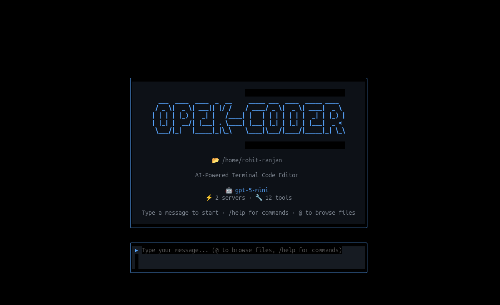
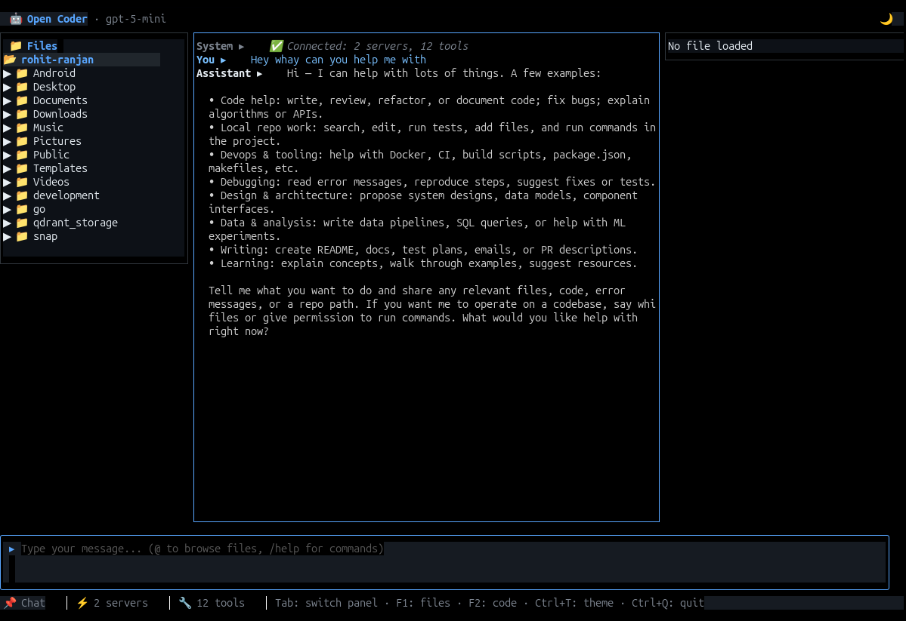

# Open Coder




A powerful AI coding agent that interacts with your codebase through natural language conversations with full access to create, read, delete, and update files using the Model Context Protocol (MCP).

## Features

- **Modern TUI Interface** - Aesthetic split-pane terminal UI built with Bubble Tea
- **Interactive File Tree** - Browse and select files from a sidebar
- **Code Panel** - View and scroll through code files with syntax highlighting
- **Git Diff View** - VS Code-style diff viewer with file sidebar and syntax highlighting
- **Natural Language Interface** - Chat with the AI agent using plain English
- **File System Operations** - Complete CRUD operations on files
- **Model Context Protocol (MCP)** - Extensible tool system for adding new capabilities
- **Streaming Responses** - Real-time AI responses with tool execution feedback
- **Multi-server Support** - Connect to multiple MCP servers simultaneously
- **Themes** - Switch between Dark and Light modes
- **Codebase Indexing** - Semantic search with vector embeddings
- **Binary File Handling** - Images open in system viewer; binary files are detected automatically
- **Text Wrapping** - Proper word wrapping for narrow terminals

## Project Structure

```
open-coder/
├── main.go                 # Main entry point
├── go.mod                  # Go module dependencies
├── README.md               # This file
├── install.sh              # One-script installer
├── pkg/                    # Reusable packages
│   └── indexer/            # Codebase indexing package
├── ui/                     # TUI Implementation (Bubble Tea)
│   ├── model.go            # Main UI model
│   ├── styles.go           # Lipgloss styles
│   ├── filetree.go         # Interactive file tree component
│   ├── codepanel.go        # Code viewer component
│   └── diffpanel.go        # Git diff viewer component
└── tools/                  # MCP server tools directory
    ├── file-access/        # File operations MCP server
    └── terminal/           # Terminal operations MCP server
```

## Tools & Capabilities

Open-Coder automatically discovers and connects to all MCP servers in the `tools/` directory.

### Built-in Tools

**File Operations MCP Server** (`tools/file-access/`)
- `read_file` - Read file contents with optional line ranges
- `read_line_range` - Read specific lines from a file
- `write_file` - Create or overwrite files
- `edit_line_range` - Edit specific lines in a file
- `list_directory` - List directory contents (with recursive option)
- `search_files` - Find files by name patterns
- `search_content` - Search text within files
- `delete_file` - Delete files/directories

**Terminal Operations MCP Server** (`tools/terminal/`)
- `run_terminal_cmd` - Execute system commands
- `run_terminal_cmd_with_input` - Execute commands with stdin input

### Adding Custom Tools

Add your MCP server to the `tools/` directory with zero configuration:

```
tools/
└── my-custom-tool/
    └── main.go  # Your MCP server implementation
```

The install script will automatically build, install, and connect your tool.

## Quick Start

### Prerequisites

- Go 1.25.1 or later (for building)
- OpenAI API key

### Installation

```bash
cd open-coder
go mod tidy
./install.sh
```

The install script will:
- Check for Go installation
- Auto-discover and build all tools in the tools/ directory
- Install main application and MCP servers to ~/.open-coder/
- Add to your PATH
- Configure environment variables

### Run

```bash
open-coder
```

On first run, you'll be prompted for your OpenAI configuration (API Key, Base URL, Model). This is saved to `~/.open-coder/config`.

You can also set environment variables:
```bash
export OPENAI_API_KEY="your-api-key"
export OPENAI_BASE_URL="https://api.openai.com/v1"
export OPENAI_MODEL="gpt-4o-mini"
```

## Usage

The interface features a modern TUI with split panes:
- **Left** - File Tree (browse directory structure)
- **Center** - Chat Interface (talk to the agent)
- **Right** - Code Panel (view selected files)

### Key Bindings

| Key | Action |
|-----|--------|
| `Tab` | Cycle focus (File Tree → Chat → Code Panel) |
| `Shift+Tab` | Reverse cycle focus |
| `F1` | Toggle Sidebar (File Tree) |
| `F2` | Toggle Code Panel |
| `F3` | Toggle Git Diff View |
| `Ctrl+T` | Toggle Theme (Light/Dark) |
| `Ctrl+L` | Clear Chat |
| `PgUp`/`PgDn` | Scroll Chat History |
| `Enter` | Send Message (in Chat) |
| `Ctrl+C` | Cancel Tool / Quit |

### Commands

| Command | Description |
|---------|-------------|
| `/help` | Show help menu |
| `/settings` | Open settings menu |
| `/index` | Index current codebase |
| `/diff` | Show git diff (unstaged changes) |
| `/diff --staged` | Show staged changes |
| `/theme` | Toggle color theme |
| `/clear` | Clear chat history |
| `@` | Open file browser |

### Git Diff View

The `/diff` command opens a VS Code-style split-pane diff viewer:

| Key | Action |
|-----|--------|
| `h` / `←` | Focus file list sidebar |
| `l` / `→` | Focus diff content |
| `j` / `k` | Scroll up/down |
| `n` / `N` | Jump to next/prev hunk |
| `Tab` | Toggle staged/unstaged |
| `c` | Generate AI commit message |
| `Esc` / `q` | Close diff view |

The file sidebar shows:
- `A` (green) - Added files
- `M` (yellow) - Modified files
- `D` (red) - Deleted files
- Change counts (+X -Y) per file

#### AI Commit Message Generation

Press `c` in the diff view to generate an AI-powered commit message based on your changes:

| Key | Action |
|-----|--------|
| `c` | Generate/regenerate commit message |
| `y` | Copy commit message to clipboard |
| `q` / `Esc` | Close commit message panel |

The AI analyzes your diff (files changed, additions, deletions) and generates a commit message following conventional commit format (feat:, fix:, refactor:, etc.).

> **Note:** Clipboard copy requires `xclip`, `xsel`, or `wl-copy` (Wayland) to be installed on Linux.

### Codebase Indexing

The `/index` command creates a semantic search index of your codebase:

```
/index
Indexing [████████░░] 80/100 - pkg/indexer/main.go
Indexing complete! 15 files → 47 chunks
```

**Features:**
- Persistence: Indexes saved to disk and reused
- Progress: Real-time progress bar
- Smart Chunking: AST-based (Go, JS/TS, Python) or line-based

### Binary File Handling

- **Images** (png, jpg, gif, etc.) open in your system's default image viewer
- **Binary files** (exe, pdf, zip, etc.) display `[Binary file - cannot display]`

## Configuration

### Environment Variables

| Variable | Description | Required |
|----------|-------------|----------|
| `OPENAI_API_KEY` | Your OpenAI API key | Yes |
| `OPENAI_BASE_URL` | API endpoint URL | Yes |
| `OPENAI_MODEL` | Model to use | Yes |

## Architecture

### Core Components

1. **Agent Logic** - Manages OpenAI connection and tool execution
2. **TUI (Bubble Tea)** - Terminal user interface and input handling
3. **MCP Client** - Connects to MCP servers for capabilities
4. **Indexer** - Semantic code indexing and search

### Data Flow

```
User Input → TUI → Agent → OpenAI API
                      ↓
                 MCP Client → Tools (File/Terminal)
                      ↓
                   Agent → TUI → Display
```

## Security Notes

- File operations execute in the current working directory
- Recursive deletion can be dangerous - backup important files
- Terminal commands run with your user permissions

## Development

### Adding New MCP Servers
1. Create a new directory under `tools/`
2. Implement the MCP server in `main.go`
3. Run `./install.sh` to rebuild and connect

### Testing
```bash
go test ./...
```

## Dependencies

- charmbracelet/bubbletea - Terminal UI framework
- charmbracelet/lipgloss - Terminal styling
- charmbracelet/glamour - Markdown rendering
- modelcontextprotocol/go-sdk - MCP implementation
- openai/openai-go - OpenAI client
- qdrant/go-client - Vector database client

## Contributing

1. Fork the repository
2. Create a feature branch
3. Make your changes
4. Submit a pull request

## License

MIT License

## Troubleshooting

- **Rendering Issues** - Ensure your terminal supports true color (iTerm2, Alacritty, VS Code Terminal)
- **Font Issues** - A Nerd Font is recommended for icons
- **Image Files** - If images don't open, ensure `xdg-open` is available on your system
